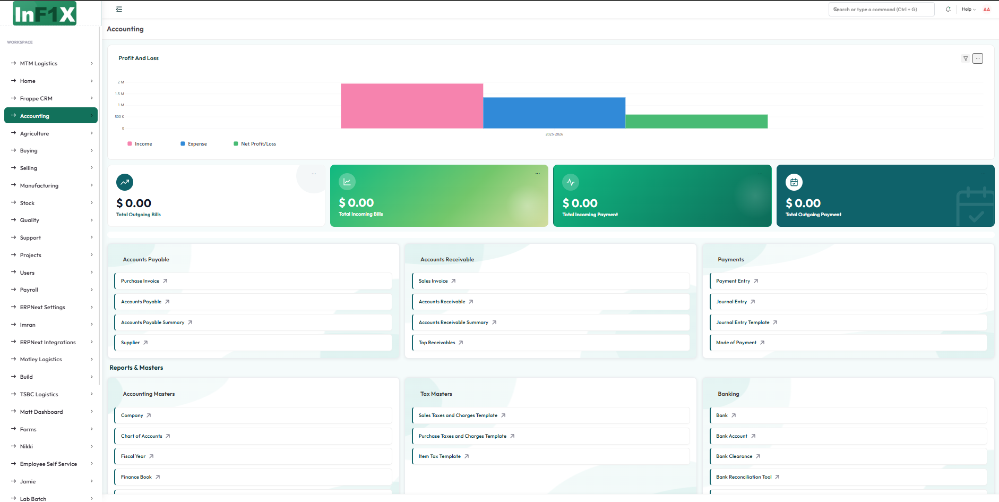

<div align="center">
  <h1>InFiX Theme for Frappe / ERPNext (v15)</h1>
  <p><i>A beautifully crafted, modern glassmorphic theme for Frappe and ERPNext</i></p>
</div>

<hr />

## Overview

**InFiX Theme** is a cutting-edge aesthetic overhaul for your Frappe / ERPNext workspace. It radically modernizes your desk experience by replacing the default layout with fresh, deeply considered modern designs. It features glassmorphism, dynamic micro-animations, a modernized responsive sidebar navigation, and soft pastel interactive widgets that bring your screen to life.

## Preview



## Features

- **Modern Layouts & Glassmorphism:** Clean, soft translucency combined with beautifully tuned drop shadows.
- **Dynamic Workspaces:** Fully responsive sidebar utilizing customizable animated `iconify` icons.
- **Micro-Interactions:** Subtle hover states, uniquely colored expanding geometric orbs, and playful widget cards.
- **Custom Color Palette:** Curated earthy, warm, and bright pastel tones inspired by premium modern web design aesthetics.
- **Custom Login Page:** Modern card-based login with animated background.
- **Error Sound Support:** Audio feedback on form errors, submissions, and cancellations.

## Installation

```bash
cd frappe-bench
bench get-app https://github.com/OsamaASidd/InFiX_theme_Frappe.git
bench install-app infix_theme
```

## Contributing

This app uses `pre-commit` for code formatting and linting. Please [install pre-commit](https://pre-commit.com/#installation) and enable it for this repository:

```bash
cd apps/infix_theme
pre-commit install
```

Pre-commit is configured to use the following tools for checking and formatting your code:
- `ruff`
- `eslint`
- `prettier`
- `pyupgrade`

## License

This software is released under the **MIT** License.
